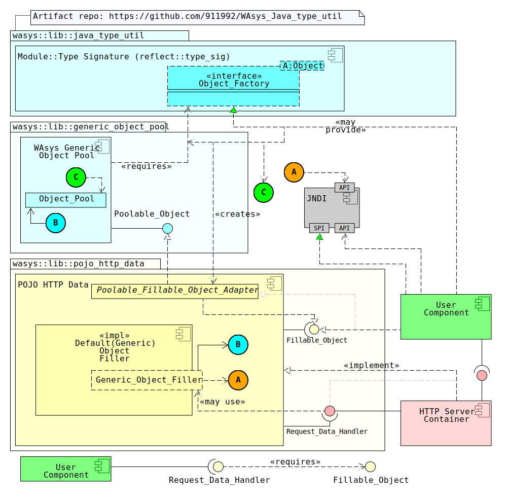
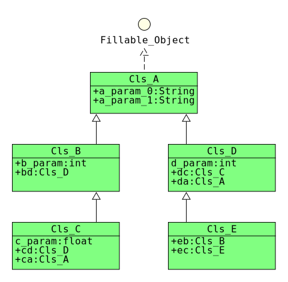

# WAsys_pojo_http_data
A simple and generic lib, to convert and validate http requests into native java types  

**POJO HTTP Data** is more like a spec(API), rather than real standalone implemented library. However, it has a default builtin implementation about POJO data manipulation.  
It lands as a layer, between a HTTP Server Container(thinking a Servlet impl like [Apache Tomcat](https://tomcat.apache.org), or etc...), and user business layer.  

Simply, it **ease** the way for grabbing data from HTTP level, into java type level.  

  
*diagram 0: social media vector*

## Revision History
Latest: v0.4.1 (Apr 19, 2021)  

Please refer to [release_note.md](./release_note.md) file  

## Requirments
0. Java 1.8  
1. A HTTP Server Container (component)
2. [WAsys_Java_type_util](https://github.com/911992/WAsys_Java_type_util)
3. [WAsys_generic_object_pool](https://github.com/911992/WAsys_simple_generic_object_pool) (a simple object pooling implementation)


## Implementations
Here is the list of available implementations(and wrapprs), that would make this project run.  

0. Servlet 3.0 Wrapper (repo: [WAsys_pojo_http_data_servlet3_wrapper](https://github.com/911992/WAsys_pojo_http_data_servlet3_wrapper)) (support for Servler 3.0 and later)

**Note:** Term *implementation*, may refer to implementing(dropping defualt one) the POJO(`Fillable_Object`) filler and a prser modules, or as a *wrapper* that implements the *HTTP Server Component* for supporting a specific lib/engine/spec.

## Shall I Read Stuffs Ahead?
You are probably looking for some sample and fast API explination, so if yes(if you are a end-user), then `false`, you don't need to read and understand the content, instead you may also check [WAsys_pojo_http_data_test](https://github.com/911992/WAsys_pojo_http_data_test) repo, that contains some sample of this lib.

But if you like to implement the lib/API for your(or one) HTTP Server Container, or beter would like to contribute, so you are welcome.  

## Maven Repository
This repo now could be grabbed from the central maven repository(thanks sonatype, and apache)  

Considering following dependency, add it to your `pom.xml` maven file  
```xml
<dependency>
  <groupId>com.github.911992</groupId>
  <artifactId>WAsys_pojo_http_data</artifactId>
  <version>0.4.1</version>
</dependency>
```

*Not a maven project? this project is ant compatible too*  
*you may also grab artifact(s) from the [central maven repo](https://mvnrepository.com/artifact/com.github.911992/WAsys_pojo_http_data) too.*


## Composition Structure
  
*diagram 1: [Composition structure diagram](./_docs/diagrams/composite_struct_diagram.svg)*

### Explination
**Overall:** **User Component** defines its **`Fillable_Object`**s and asks **POJO HTTP Data** componeent using an implementation of `Request_Data_Handler` that is provided by a **HTTP Server Container** componenet.  

Considering following more detailed explination for each componenet.
#### Component: POJO HTTP Data
This component provides types(enums, interfaces, annotations,...) are required for end-user to utilize the lib(POJO manipulation).  

It has a default implementation about POJO manipulation, that would be used by `Generic_Object_Filler` class. The **HTTP Server Container** may or may-not use the default implementation.  
#### Component: HTTP Server Container  
This component should complete the implemntation of the library by providing a wrapper class between desired `Request_Data_Handler` type and its related HTTP request type(thinking of `HttpServletRequest` for Servlet API)  

As mentioned, default POJO manipulator may or may not be used by **HTTP Server Container** component, but need to respect the expected behaiviors(following API(POJO HTTP Data) requirments)  
**User Component** May or may not intract with **HTTP Server Container** component, so implementation of **HTTP Server Container** component should be in a such a way to allow **User Component** utilizing the library without 3rd. party API calls.  
#### User Componenet
This componenet is actually end-user which needs its POJOs filled. User needs to mark all POJOs fillable, by implementing the `Fillable_Object` or extending it's adapter as `Fillable_Object_Adapter`, or `Poolable_Fillable_Object_Adapter`.  

This component needs an instance of `Request_Data_Handler` which should be provided by **HTTP Server Container** componenet. For example using the Servlet wrapper in a Servlet env, and etc.
#### WAsys Generic Object Pool
As mentioned, this is recommended to pool POJOs to gain more performance, and better memory managment, however that plain two main interfaces `Fillable_Object`, and `Request_Data_Handler` are not dependent to this componenet, but their adapters `Fillable_Object_Field_Signature`, and `Poolable_Request_Data_Handler_Adapter` are.  

**Note:** Since version **0.2.0**(and earlier), dependency to this module/component is an essential, as the default filler uses a pooled version of context to track filled types.

**Note:** Using `Fillable_Object_Field_Signature`, and `Poolable_Request_Data_Handler_Adapter`will not mark the target types poolable magically, please check out [WAsys_generic_object_pool](https://github.com/911992/WAsys_simple_generic_object_pool) repo for more help.

#### JNDI
The default filler needs a *maximum pool size*, in order to initialize its internal `Object_Pool`.

It checks the JNDI to check if any valid (which is a decodable number in `String` type) value were registered to the JNDI or not. If it fails(missed/invalid number), then it searches the system properties with the same key.  
Finally if both failed, the default pool max value will be used.  

Considering following info about JNDI/system-properties look up  
* **JNDI key name**: `WAsys_Generic_Object_Filler_ARRAYLIST_POOL_MAX` (please refer to `Generic_Object_Filler.ARRAYLIST_POOL_MAX_VAL_LOOKUP_KEY`)
* **Expected value**: A positive, and decodable number in `String` type/scheme.
* **Default value**: `8` (please refer to `Generic_Object_Filler.ARRAYLIST_DEFAULT_POOL_MAX_VAL`)

JNDI dependency was added since version **0.2.0**.

## Class Diagram
  
*diagram 2: [Class diagram](./_docs/diagrams/class_diagram.svg)*


## Library API
Using library is very easy(if you are experienced enough), since implementing a managed POJO for user should not be a big deal. One important thing is about keeping the state of the POJOs correct, specially if you using the pooled adapters.  

### Supported Types
Here is the list of supported types. Types are considered for filling, any other types are not listed will be ignored.
* `byte`, `short`, `int`, `Long`, `float`, `double`, and wrapper(`Byte`,`Short`,...) classes.(being `final` is not allowed)
* `String` (being `final` is not allowed)
* `OutputStream` or inherited types(could be `final`, and `null`)
* `Fillable_Object` type (could be `final`, but not `null`)

### Field/Param Definition
Depending on filling mode(`Object_Fill_Mode`), signature of a `Fillable_Object` could be done by default type parser at runtime, or manually by user specification.

If a `Fillable_Object` needs to be presented by user(where `fill_mode()` returns `Object_Fill_Mode.Type_Manipulator`), user need to prepare a list(array) of field signatures(`Fillable_Object_Field_Signature`), to return it as `Fillable_Object_Manipulator` when `get_type_descriptor()` is called by the parser.

Otherwise(by default), a type is analyzed and parsed at runtime using reflection by the parser.

Using `Object_Fill_Mode.Type_Manipulator`, user is able to set all meta-data related of a field, meanwhile this could be done by `Field_Definition` when parsing mode is `Object_Fill_Mode.Reflection_Type_Fields`.

Example:
```java
/*mean a parameter named name, as non-null (no size/len check)*/
private String name;

/*mean http param name is 0_val, should be between 2047(inclusive) and 63(inclusive)*/
@Field_Definition(param_name = "0_val",max_val_or_len = 2047 , min_val_or_len = 63)
private int attr_0;
```

**Note:** by default(when `Object_Fill_Mode.Reflection_Type_Fields` for type parsing), param-names will be idetified by POJO related field-name, as non-`null`, and no bound checking.

**Note:** Since update `0.2.5`, `Field_Definition` has two `max_???`/`min_???` attributes, that `max_float_point_val`, and `min_float_point_val` are *only* for `float`, and `double` fields, and will be *ignored* if the type is something else. Same for `max_val_or_len`, and `min_val_or_len` are for only `String`, `OutputStream`, and integer-based types, and will be ignored for `float`, and `double`.

Also considering check more [samples](#Sample-Usage).

### POJO Parsing Method
A POJO could be introduced by user manually, or get parsed using reflection at runtime(default). If User wishes to provide the POJO fingerprint(field signatures), so the result may get validated.  

Default POJO parser (`Fillable_Object_Parser`) validate the given POJO fingerprint by user.

Please mind since v0.1.6, the default parser parses and prepare the type fingerprint as `parent(s) -to-> child/type` order.

**Note:** since update version `0.2.1` (20200724), any *non* `Field_Definition` annotated field that its name is started using two double-underscore `__` char will be ignored for filling.

### POJO Caching Policy
By **default**, a POJO fingerprint should be cached for performance related stuffs, however this policy could be ignored.

Please mind the default POJO parser (`Fillable_Object_Parser`) **caches** the POJO fingerprint by default, unless type is marked as no-cache explicitly(annotated by `No_Type_Cache`).

### Field Filling
Once a POJO get parsed, and asked to get filled, the filler need to know what kind of data need to be read from HTTP request instance(`Request_Data_Handler`), and to be set to related POJO field.  

#### Manual Field Set Mode Using `Fillable_Object_Manipulator`
When setting params should be done by user, as the POJO need to implement `Fillable_Object_Manipulator` interface, and return `Type_Manipulator` when `field_set_mode()` method is called from parser.

This means for params need to be read and be set to the POJO, parser only needs to validate and parse data, and pass it as `Object` to POJO `set_field_value` method.

#### Field Set Mode Using Reflection
This mode tells the parser, to set the data to related fields(default behavior).  

During the parse stage, the parser have to check if a marked field/param has an associated setter method or not.

The setter method could be marked either using `Field_Definition`(has priority) or `Field_Setter_Method` annotations. Please mind setter should not be `static`.

If the method was not found, parser may decides to either set the field directly(no setter method, if applicable), or go for another check and hope for find the `setAaa(<<field-type>>):void` method(where `Aaa` is the name of the field).  

mind the default POJO parser (`Fillable_Object_Parser`) checks all paths above, considering following diagram.  

  
*diagram 3: [Field setter method finding algorithm](./_docs/diagrams/pojo_field_setter_memeber_alg.svg)*
 
### HTTP File(part) Upload Handling
For asking for a file upload data(part), POJO should have a `OutputStream`(or inherited) field.  

The setter method defined for `OutputStream`(or inherited types) are ignored, since the API works in some other approach.

Once the Filler finds the part available, in informs the POJO by calling the `prepare_for_part(...):bool` to inform user/POJO, there will be a file stream data.  

POJO now would perform some specific op to prepare requirements for that streaming op, and it **MUST** return `true` if the stream have to happen, otherwise (by `false`), it means ignore streaming for filler module. 

Then filler calls for `part_io_stream_mode(void):Part_field_Stream_Mode` to know if the related part stream should be passed to pojo for a user specific io op(using `part_stream()` method), or asks the concreted `Request_Data_Handler` to perform a whole in to out stream mode.

If the POJO/user asked for direct field streaming mode(returned `Stream_To_Field` by `part_io_stream_mode()` method), then by end of the streaming, filler `flush()` the related POJO `OutputStream`, and calls the `part_streaming_done(:String,:int,arg_io_ok:bool):void` method, to inform the POJO/user if the field streaming was success or not (as `arg_io_ok` param)

## Filling Policy For `Reflection_Type_Fields` Type Prsing Mode
Since lib version 0.1.6(May 25, 2020), the default parser (`Fillable_Object_Parser`), scrap fillable fields for a `Fillable_Object` from `parent(s) -to-> child/type` order. It means the top-level parent will have high-priority for filling, as the actual type will be the last one.

Considering following scenario

  
*diagram 4: [Filling scenario sample 0](./_docs/diagrams/inner_fillable_scenario0.svg)*

Where considering, filling a `Cls_C` type is appreciated, so here is the filling process by `Generic_Object_Filler`  
Filling Type `Cls_C`:  

<pre>
0. a_param_0 (fill as inherited)
1. a_param_1 (fill as inherited)  
2. b_param  
3. bd (fill as unique type)  
    0. a_param_0 (fill as inherited)  
    1. a_param_1 (fill as inherited)  
    2. d_param 
    3. (dc gets ignored, becasue of real/actual fill type)  
    4. da (fill as unique type)  
        0. a_param_0 (fill as inherited)  
        1. a_param_1 (fill as inherited)  
4. c_param  
5. (cd gets ignored, because of Cls_B.bd)  
6. (ca gets ignored, because of Cls_D.da)  
</pre>

**Notes**  

Inheritted types are *not counted* by filling a child type, so this is becasue `a_param_0`, and `a_param_1` from `Cls_A` are filled 3 times  
* 1st. fill (0 and 1) becasue of inherited from `Cls_C` (actual object)
* 2nd. fill (3.0, and 3.1) because of inherited from `Cls_D` (inner fillable object)
* 3rd. fill (3.4.0, and 3.4.0) because of unique/direct link to `Cls_A`

But `Cls_D.dc`, `Cls_C.cd`, and `Cls_C.ca` are ignored, becasue of duplicated-direct types for filling.

### Inner `Fillable_Object` Filling
Inner `Fillable_Object` should be supported, as `Generic_Object_Filler` supports it too.  

The target `Fillable_Object` field should not be null at the time parser is trying to access it, otherwise parser should not attempt to create a new instance and fulfill it.

This is because of creation policy of the target `Fillable_Object` type, where it could be a `Poolable_Object`, so target object may be created/acquired by user in a specific way.  

A `Fillable_Object` field should not be `null`, or it gets ignored.  

**Note:** by default, the `Generic_Object_Filler` fills a `Fillable_Type` once for each fill op, to avoid recursion possibilities. So if a type has two `Fillable_type` inner fields from a type, the second one will be ignorred.

## Default POJO Filler `Generic_Object_Filler`
This class provides a default POJO filling functionality, that could be used by target HTTP Server Container component.  
Considering following list contains policies are followed by default POJO manipulator(`Generic_Object_Filler`).  
* All `static` fields are ignored for fulfillment.
* Primitive(and wrappers) fields that have `final` modifier are ignored(even when a setter methods are specified).
* Inner inherited `Fillable_Object`, and `OutputStream` could be marked as `final`, since there will be no method setter call for them.
* Param read and field set are done as Fields order in POJO.
* Duplicated inner `Fillable_Object` types are ignored for fulfillment for each fill op(to avoid possible recursion).
* Parsing and filling a `Fillable_Object` comes as **`parent(s) -> child`** order (effective since v0.1.6)
* A marked field may or may not have a setter method. The default setter method should be in `setAaa(:<<Field_Type>>):void` format(where `Aaa` is the name of the field)

## `Fillable_Object_Adapter` Type
This is a semi-stateful implementation of `Fillable_Object`, that could track if a filling was success or not.

Please note during the filling op, there will be zero exception related to POJO filling, so this is user duty to track if a filling was success or not by listening to failed filling events from object filler.

`Fillable_Object_Adapter` type(and it's poolable child `Poolable_Fillable_Object_Adapter`) would track the generic object filling, by implementing generic field fill event listeners.

**Note:** Since v0.1.6, `Fillable_Object_Adapter` is not a `Fillable_Object_Parse_Cache_Accelerator`, as used to cause a very stupid bug(sorry for myself `-_-`), now any global-fast type fingerprint cache should be done by user impl.

  
*diagram 5: [Fillable_Object_Adapter type state diagram](./_docs/diagrams/Fillable_Object_Adapter_type_state_diagram.svg)*

## Reading Parameter Order And Policy
Reading parameters is done as order of parameters are provided by URL path(request-line), and any parameter at the body part(either `multipart`, or as form data).

Considering following simple request:   

```
POST /gateway?user=911&user=992&user=991
Content-Length: 10

user=991.2
```

As there are 4 `user` parameters. Considering the order of reading parameters will be as following  

0. 911 *(request-line)*
1. 992 *(request-line)*
2. 991 *(request-line)*
3. 991.2 *(content/body)*

Where the order is `request-line`, then body content. No matter if the content is a multipart or not.

## `Request_Data_Handler` And `multipart` Request Data
Considering following policies must be applied by the `Request_Data_Handler` implementer.

### Identifying Streamable Content
File uploading must be happened as a `multipart` `POST` request. According to the `HTTP` RFC7578([§4.2](https://tools.ietf.org/html/rfc7578#section-4.2)), the part may, or may not come with a `filename` parameter to tell the name of the file is being uploaded, however the **HTTP Server Component** (`Request_Data_Handler` implementer) MUST treat every part of a `multipart` request as a streamable data.

This means, even form data could be grabbed as a fileupload content. This may be even good for processing large text input(e.g. by a lenghty textarea).

Due to this, so please considering about `Fillable_Object.prepare_for_part()` method the is called when a part is being ready for streaming/providing, that `mime`, and `filename` parameters *COULD* be a `null`.

Considerring following `multipart` `POST` request sample  

```
POST /fileupload/upload HTTP/1.1
Host: localhost:1931
Content-Type: multipart/form-data; 
boundary=---------------------------boundary-911992
Content-Length: 441
-----------------------------boundary-911992
Content-Disposition: form-data; name="file"; filename="ghuser.txt"
Content-Type: text/plain

Github user(s):911992
-----------------------------boundary-911992
Content-Disposition: form-data; name="cvalidation"

true
-----------------------------boundary-911992
Content-Disposition: form-data; name="func__"

update
-----------------------------boundary-911992--
```

As beside `cvalidation`, and `func__` are formdata, but could be treated as file/stremable content.

### Identifying Form Data
According to RFC7578, there is no explicitly way to find out if a part is a form data or a fileupload.

By default, `Request_Data_Handler` should consider parts come without any `content-type` as a form data. This policy *MUST* be applied when finding a parameter is desired(cosidering `Request_Data_Handler.get_param_at()` method).

### Identifying the Content Charset
According to RFC7578([§4.5](https://tools.ietf.org/html/rfc7578#section-4.5), and §5.1.2 ), the agent may, or may not send the charset it used for encoding the content using `content-type` part header. But the most better way is using the `_charset_` part field, that comes with a `ASCII` content, identifies the charset for form data.

By default `_charset_` field is check, no matter if it was used explicitly by user as a user param or not, if it fails, then for each part, `content-type` should be checked, and if both failed, the default `UTf-8` will be used.

## Global-Fast Type Fingerprint Cache Using `Fillable_Object_Parse_Cache_Accelerator`
Finding a type cache is done using a simple loop/search in default parser/ctx (`Fillable_Object_Signature_Context`). In a situation, this loop up may hit some small/big performance impact, to loop up for a fingerprint of a type everytime it needs to be filled.

The Solution is about keeping a type's cache fingerprint somehwree which could be accessed and found very fast. Simply using a static field withing each dedicated/standalone `Fillable_Object`.

User may implement the `Fillable_Object_Parse_Cache_Accelerator` method, and save the passing fingerprint `Object` somehere **`static`** and safe in related type.

**Note:** Please make sure how does this `Fillable_Object_Parse_Cache_Accelerator` is supposed to be implemented, or this might make the fast idea being this caching solution a true slow disaster.

Considering following diagram, as a typical/generic `Fillable_Object` type that supports for `Fillable_Object_Parse_Cache_Accelerator`.  

  
*diagram 6: [Typical `Fillable_Object` Type that supports `Fillable_Object_Parse_Cache_Accelerator diagram`](./_docs/diagrams/typical_fillable_object_type_with_cache_acc.svg)*

**Note(s) about above diagram**  
Please mind **both** `Cachable_Entity`, and `Cachable_Entity_Child` has overriden the methods of `Fillable_Object_Parse_Cache_Accelerator`.  
It doesn't matter if parent(`Cachable_Entity`) is a `Fillable_Object_Parse_Cache_Accelerator`, so its child (`Cachable_Entity_Child`) will be, this is *technically* `true`, but *logically* false.  

This is becasue each standalone/dedicated `Fillable_Object` type is needed to implement the fast-cache idea(`Fillable_Object_Parse_Cache_Accelerator`) **MUST** implement the related method indivisually.  

* Type `Cachable_Entity` sets the given cache object by `_api_ex_set_type_parse_result` to its `private` and **`STATIC`** `type_cache_parent` field. As it returns the same object when `_api_ex_get_type_parse_result` is called by an instance or class-level invocation.  
* Type `Cachable_Entity_Child` is technically a `Fillable_Object_Parse_Cache_Accelerator`(since its parent/`super` is), but it **MUST** override the related fast-cache methods *again*. Now it stores and reads its dedicated type cache from its dedicated and **`STATIC`** `type_cache_child` field.  

Generally, you may think `Fillable_Object_Parse_Cache_Accelerator` have to be implemented at *class* level, not object.  
By default each cache for a type is proceed only once, so it lands at type-level, rather than instance-level  

You may please check out the Sample7 in [WAsys_pojo_http_data_test](https://github.com/911992/WAsys_pojo_http_data_test) repo for an instance.

## Utilizing The Lib
Since version **0.2.0**, and later, you may add the project from maven central repo (please check [Maven Repository](#maven-repository) section).

Or you may build the project using ant also, or get the artifacts from maven central repo if your project is not a maven one.

**Note:** Please mind since version **0.2.0** and later, you have to link/add [WAsys_generic_object_pool](https://github.com/911992/WAsys_simple_generic_object_pool) lib too.
  
Make sure you have the correct **HTTP Server Container** component that completes the impl of the lib(you'd probably need to wait a little longer, so I would give Server wrapper(and a test repo) for the lib)

Associate the real HTTP request handler to `Request_Data_Handler` (or its adapter types), and it's done! Have your POJOs implement `Fillable_Object`(or extend from its adapters), and enjoy HTTP pojo data!

## Sample Usage
* **[WAsys_pojo_http_data_test](https://github.com/911992/WAsys_pojo_http_data_test)** Sample implementation of this lib, for testing purpose(not a real HTTP Server Container!)  
* **[WAsys_pojo_http_data_servlet3_wrapper_test](https://github.com/911992/WAsys_pojo_http_data_servlet3_wrapper_test)** Sample usages based on [WAsys_pojo_http_data_servlet3_wrapper]([WAsys_pojo_http_data_servlet3_wrapper_test](https://github.com/911992/WAsys_pojo_http_data_servlet3_wrapper))

## Meta 
Also considerign following libs/tools may related to this repo
0. [WAsys_pojo_http_data_entity_tool](https://github.com/911992/WAsys_pojo_http_data_entity_tool) tool to generate `Fillable_Object` (and `Poolable_Object`) entities
1. [WAsys_Poolable_Object_generator_tool](https://github.com/911992/WAsys_Poolable_Object_generator_tool) tool to generate `Poolable_Object` entities

## TODOs
- [ ] (*important*) Integrate the lib with [`WAsys_Java_type_util`](https://github.com/911992/WAsys_Java_type_util) for parsing types
