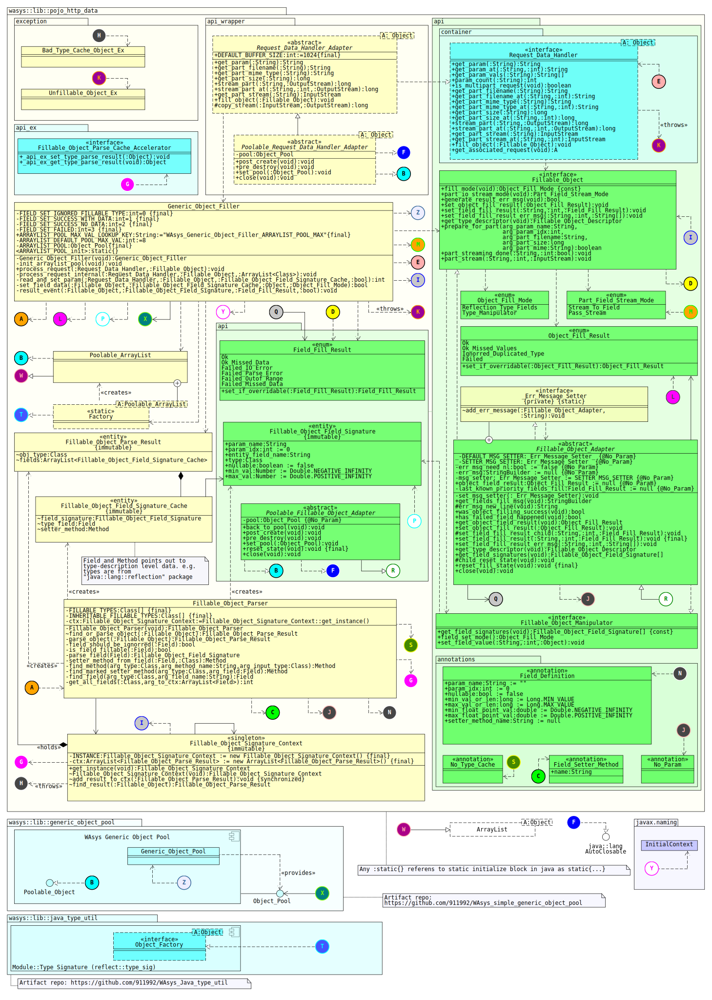

# WAsys_pojo_http_data
A simple and generic lib, to convert and validate http requests into native java types  

**POJO HTTP Data** is more like a spec(API), rather than real standalone implemented library. However, it has a default builtin implementation about POJO data manipulation.  
It lands as a layer, between a HTTP Server Container(thinking a Servlet impl like [Apache Tomcat](https://tomcat.apache.org), or etc...), and user business layer.  

Simply, it **ease** the way for grabbing data from HTTP level, into java type level.  

## Revision History
Latest: v0.1.5 (May 24, 2020)  

Please refer to [release_note.md](./release_note.md) file  

## Requirments
0. Java 1.8  
1. A HTTP Server Container (component)
2. [WAsys_generic_object_pool](https://github.com/911992/WAsys_simple_generic_object_pool) (a simple object pooling implementation) (optional)  

**Note:** dependency to WAsys_generic_object_pool lib is optional. It means user, and/or HTTP wrapper modules may or may not utilize the poolable types(but recommended).

## Shall I Read Stuffs Ahead?
You are probably looking for some sample and fast API explination, so if yes(if you are a end-user), then `false`, you don't need to read and understand the content, instead you may also check [WAsys_pojo_http_data_test](https://github.com/911992/WAsys_pojo_http_data_test) repo, that contains some sample of this lib.

But if you like to implement the lib/API for your(or one) HTTP Server COntainer, or beter would like to contribute, so you are welcome.  

## Composition Structure

### Explination
**Overall:** **User Component** defines its **`Fillable_Object`**s and asks **POJO HTTP Data** componeent using an implementation of `Request_Data_Handler` that is provided by a **HTTP Server Container** componenet.  

Considering following more detailed explination for each componenet.
#### Component: POJO HTTP Data
This component provides types(enums, interfaces, annotations,...) are required for end-user to utilize the lib(POJO manipulation).  

It has a default implementation about POJO manipulation, that would be used by `Generic_Object_Filler` class. The **HTTP Server Container** may or may-not use the default implementation.  
#### Component: HTTP Server Container  
This component should complete the implemntation of the library by providing a wrapper class between desired `Request_Data_Handler` type and its related HTTP request type(thinking of `HttpServletRequest` for Servlet API)  

As mentioned, default POJO manipulator may or may not be used by **HTTP Server Container** component, but need to respect the expected behaiviors(following API(POJO HTTP Data) requirments)  
**User Component** May or may not intract with **HTTP Server Container** component, so implementation of **HTTP Server Container** component should be in a such a way to allow **User Component** utilizing the library without 3rd. party API calls.  
#### User Componenet
This componenet is actually end-user which needs its POJOs filled. User needs to mark all POJOs fillable, by implementing the `Fillable_Object` or extending it's adapter as `Fillable_Object_Adapter`, or `Poolable_Fillable_Object_Adapter`.  

This component needs an instance of `Request_Data_Handler` which should be provided by **HTTP Server Container** componenet. For example using the Servlet wrapper in a Servlet env, and etc.
#### WAsys Generic Object Pool (optional)
As mentioned, this is recommended to pool POJOs to gain more performance, and better memory managment, however that plain two main interfaces `Fillable_Object`, and `Request_Data_Handler` are not dependent to this componenet, but their adapters `Fillable_Object_Field_Signature`, and `Poolable_Request_Data_Handler_Adapter` are.  

**Note:** Using `Fillable_Object_Field_Signature`, and `Poolable_Request_Data_Handler_Adapter`will not mark the target types poolable magically, please check out [WAsys_generic_object_pool](https://github.com/911992/WAsys_simple_generic_object_pool) repo for more help.

## Class Diagram

## Library API
Using library is very easy(if you are experienced enough), since implementing a managed POJO for user should not be a big deal. One important thing is about keeping the state of the POJOs correct, specially if you using the pooled adapters.  

### Supported Types
Here is the list of supported types. Types are considered for filling, any other types are not listed will be ignored.
* `byte`, `short`, `int`, `Long`, `float`, `double`, and wrapper(`Byte`,`Short`,...) classes.(being `final` is not allowed)
* `String` (being `final` is not allowed)
* `OutputStream` or inherited types(could be `final`, and `null`)
* `Fillable_Object` type (could be `final`, but not `null`)

### POJO Parsing Method
A POJO could be introduced by user manually, or get parsed using reflection at runtime(default). If User wishes to provide the POJO fingerprint(field signatures), so the result may get validated.  

Default POJO parser (`Fillable_Object_Parser`) validate the given POJO fingerprint by user.

### POJO Caching Policy
By **default**, a POJO fingerprint should be cached for performance related stuffs, however this policy could be ignored.

Please mind the default POJO parser (`Fillable_Object_Parser`) **caches** the POJO fingerprint by default, unless type is marked as no-cache explicitly(annotated by `No_Type_Cache`).

### Field Filling
Once a POJO get parsed, and asked to get filled, the filler need to know what kind of data need to be read from HTTP request instance(`Request_Data_Handler`), and to be set to related POJO field.  

#### Manual Field Set Mode Using `Fillable_Object_Manipulator`
When setting params should be done by user, as the POJO need to implement `Fillable_Object_Manipulator` interface, and return `Type_Manipulator` when `field_set_mode()` method is called from parser.

This means for params need to be read and be set to the POJO, parser only needs to validate and parse data, and pass it as `Object` to POJO `set_field_value` method.

#### Field Set Mode Using Reflection
This mode tells the parser, to set the data to related fields(default behavior).  

During the parse stage, the parser have to check if a marked field/param has an associated setter method or not.

The setter method could be marked either using `Field_Definition`(has priority) or `Field_Setter_Method` annotations. Please mind setter should not be `static`.

If the method was not found, parser may decides to either set the field directly(no setter method, if applicable), or go for another check and hope for find the `setAaa(<<field-type>>):void` method(where `Aaa` is the name of the field).  

mind the default POJO parser (`Fillable_Object_Parser`) checks all paths above, considering following diagram.  

 
### HTTP File(part) Upload Handling
For asking for a file upload data(part), POJO should have a `OutputStream`(or inherited) field.  

The setter method defined for `OutputStream`(or inherited types) are ignored, since the API works in some other approach.

Once the Filler finds the part available, in informs the POJO by calling the `prepare_for_part(...):bool` to inform user/POJO, there will be a file stream data.  

POJO now would perform some specific op to prepare requirements for that streaming op, and it **MUST** return `true` if the stream have to happen, otherwise (by `false`), it means ignore streaming for filler module.  

  

Where considering, filling a `Cls_C` type is appreciated, so here is the filling process by `Generic_Object_Filler`  
Filling Type Cls_C:
<pre>
0. `c_param`
1. `cd`
    0. `d_param`
    1. (`dc` gets ignored)
    2. `da`
        0. `param_a`
        1. `param_b`
2. (`ca` gets ignored)
3. `b_paranm`
4. (`bd` gets ignored)
5. `param_a`
6. `parab_b`
</pre>

### Inner `Fillable_Object` Filling
Inner `Fillable_Object` should be supported, as `Generic_Object_Filler` supports it too.  

The target `Fillable_Object` field should not be null at the time parser is trying to access it, otherwise parser should not attempt to create a new instance and fulfill it.

This is because of creation policy of the target `Fillable_Object` type, where it could be a `Poolable_Object`, so target object may be created/acquired by user in a specific way.

A `Fillable_Object` field should not be `null`, or it gets ignored.  

Considering following sample entity class diagram

**Note:** by default, the `Generic_Object_Filler` fills a `Fillable_Type` once for each fill op, to avoid recursion possibilities. So if a type has two `Fillable_type` inner fields from a type, the second one will be ignorred.

## Default POJO Filler `Generic_Object_Filler`
This class provides a default POJO filling functionality, that could be used by target HTTP Server Container component.  
Considering following list contains policies are followed by default POJO manipulator(`Generic_Object_Filler`).  
* All static fields are ignored for fulfillment.
* Primitive(and wrappers) and final fields are ignored(even when setter methods are specified).
* Inner inherited `Fillable_Object`, and `OutputStream` could be marked as final, since there will be no method setter call for them.
* Param read and field set are done as Fields order in POJO.
* Duplicated inner `Fillable_Object` types are ignored for fulfillment for each fill op(to avoid possible recursion).
* A marked field may or may not have a setter method. The default setter method should be in `setAaa(:<<Field_Type>>):void` format(where `Aaa` is the name of the field)

## `Fillable_Object_Adapter` Type
This is a semi-stateful implementation of `Fillable_Object`, that could track if a filling was success or not.

Please note during the filling op, there will be zero exception related to POJO filling, so this is user duty to track if a filling was success or not by listening to failed filling events from object filler.

`Fillable_Object_Adapter` type(and it's poolable child `Poolable_Fillable_Object_Adapter`) would track the generic object filling, by implementing generic field fill event listeners.

## Utilizing The Lib
Add the library to your project classpath, add WAsys_generic_object_pool artifact too(if required).
  
Make sure you have the correct **HTTP Server Container** component that completes the impl of the lib(you'd probably need to wait a little longer, so I would give Server wrapper(and a test repo) for the lib)

Associate the real HTTP request handler to `Request_Data_Handler` (or its adapter types), and it's done! Have your POJOs implement `Fillable_Object`(or extend from its adapters), and enjoy HTTP pojo data!

## Sample Usage
* **[WAsys_pojo_http_data_test](https://github.com/911992/WAsys_pojo_http_data_test)** Sample implementation of this lib, for testing purpose(not a real HTTP Server Container!)  

## TODOs
- [x] Documenting the source code(partial, for essential API-level types)
- [x] Test sample project that implement a simple/fake `Request_Data_Handler` to check how does `Generic_Object_Filler` work. (you may find it [here](https://github.com/911992/WAsys_pojo_http_data_test))
- [ ] Servlet 3.0 Wrapper (in progress :D, `yes!`)
- [ ] Pooling the `Vector` type that holds the `Fillable_Object` types in `Generic_Object_Filler.process_request()`

